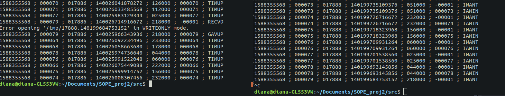

threaded-bathrooms
----------

#### IT access to bathrooms, using threads and processes to manage anxious people

## Description

It is intended to obtain a client-server type application capable of dealing with conflict situations in access to shared areas. The shared zone is a Bathroom with several unisex places, controlled by a Q process to which requests for user access are addressed. Access requests are sent through a multithreaded U process (client), and they indicate the time the interested party wishes to be in one place of the sanitary facilities. The requests will remain in a queue until they have a turn; at that time, the respective user accesses a place in the facilities during the requested time, under the control of the Q server; then the resource is released to another user. 

With this project, we demonstrate that we know and know how to use the UNIX in C programmatic interface to:

- create multithread programs;

- promote intercommunication between processes through channels with name (named pipes or FIFOs);

- avoid conflicts between competing entities, through synchronization mechanisms.

## Report

### Run

Along side with the *source files*, there is a *Makefile* with the commands used to compile all the files. Our procedure to run and test the program was:
1. Open two terminals simultaneously, in the folder containing all files and the *Makefile*.
2. Execute the `make` command in one of them.
3. Run both programs simultaneously:
   1. In one of the terminals, run `./Q2 -t <nsecs> -l <nplaces> -n <nthreads> <fifoname>` with the option to redirect or not the output to the files `q2.log` and `q2.err`.
   2. In the other terminal, run `./U2 -t <nsecs> <fifoname>` with the option to redirect or not the output to `u2.log` and `u2.err` files.
4. Wait for it to finish, according to the execution time stipulated for each
5. Optionally, if you redirect the output to log files, you would run the `./testing.sh` script, or simply the `make test` command, to check for any tests suggested in the statement.

### Messages Exchanged

Regarding the structure of the messages exchanged between the client and the server, we choose to use the `struct message` where the client stores its request data and the server the respective answer. 

The client will save, in this `struct`, its *PID* and *TID*, necessary to create the private channel where it receives the response from the server, the requested time duration, and its sequential number. Finally, it sends to the server a request through the public channel received as parameter. 

On the server, when receiving the request from the client through this public channel, you must change the `struct`, updating with your PID and TID. In case the server is not working anymore, change the pl and dur to -1, to indicate the end of the service. This way you send your reply to the client, through the private channel created.

```c
typedef struct message {
    int i;
    pid_t pid;
    pthread_t tid;
    int dur;
    int pl;
    char fifoName[FIFONAME_SIZE];
} message;
```

### SIGPIPE treated

Bearing in mind that in the event of a FIFO writing attempt that no process has opened for reading, the `SIGPIPE` signal is sent to the writer process, it was necessary in both processes to ignore the signal, preventing it from leading to the end of the process and allowing the write function to return the `EPIPE` error. Thus, when the Server has finished in a forced way (`SIGINT` for example) and a writing attempt is made by the Client, *FAILD* will be written to the default output. Also in case the Client abruptly terminates we have the possibility to detect the error when the Server tries to write a response.

```c
int ignoreSIGPIPE(){
    struct sigaction action;
    action.sa_handler = SIG_IGN;;
    sigemptyset(&action.sa_mask);
    action.sa_flags = 0;

    if (sigaction(SIGPIPE, &action, NULL) < 0){
        fprintf(stderr,"Unable to install SIG handler\n");
        return ERROR;
    }

    return OK;
}
```

### Process Intercommunication through FIFOs

>The use of FIFOs and functions that allow reading and writing has ensured that it is possible to exchange messages between the processes of the Client and the Server (Bathroom).

#### Creation, Open and Reading on the server 

On the Server, after reading the arguments and after the creation (`mkfifo(...)`) of the FIFO with the name indicated on them has been successfully executed, the FIFO is opened in read mode, `O_RDONLY`, where it was chosen to activate the flag `O_NONBLOCK`, because, in order to be able to control the execution time of the server, regardless of whether or not it has requests during this period, it is necessary to avoid opening the file with the function `open(. ...)` blocks by the fact that there is still no process with FIFO open for writing. Thus, the Server does not wait indefinitely for Clients - `open(...)` is successful and returns immediately even if FIFO has not yet been opened for writing by any process, which will be the case.

```c
server_fd = open(fifoName,O_RDONLY|O_NONBLOCK)
```
In the cycle that receives requests, an attempt will be made at each iteration to read the FIFO, using the `read(...)` function to attempt to read the number of bytes occupied by the struct `message` and checking its return value:
- If, however, Clients start to make their requests, i.e. FIFO has already been opened for writing by the *U* process, `read(...)` may:
    - return an integer value greater than zero, when FIFO data has actually been read - the number of bytes read being returned, in which case a thread is created to process the request; 
    - return `EAGAIN' because FIFO was opened in `O_NONBLOCK' mode and there was nothing at FIFO to read at that instant, in which case it moves on to the next reading, freeing up the space previously allocated for the Client message. 
- If no request has been made yet, i.e. FIFO is not yet open for writing, the reading will return `EOF` so the space previously allocated to receive the message from the Client is freed, moving on to the next iteration of the request reception cycle.

```c
int r;
    // Read message from client if it exists (without blocking)
    if((r = read(server_fd, msg, sizeof(message))) < 0){
        if(isNotNonBlockingError() == OK){
            free(msg);
            break;
        }
        else{
            free(msg);
            continue;
        }
    }
    else if(r == 0){ // EOF
        free(msg);
        continue;
    }    

    // Message received
    logOP(RECVD,msg->i,msg->dur,msg->pl);    
```

A similar procedure for reading requests from public FIFO is adopted in the start function of the thread responsible for generating the threads that refuse requests when the server is shutting down, `void * server_closing(void * arg)`.

#### Opening and writing requests in the Client process

At the Client, the opening for writing, `O_WRONLY`, of the FIFO passed in the arguments is done. Then, in the order generation cycle, threads are created, leaving each thread in charge of generating an order. It should be noted that each thread will have access to the FIFO descriptor created in the initial thread, as suggested by the following statement: ("threads share the same global memory (data and heap segments)")(http://man7.org/linux/man-pages/man7/pthreads.7.html).
In the `void * client_request(int * arg)` thread start function, FIFO is created with the client identification (*PID* and *TID*), using `mkfifo(...)` once again.
This is followed by writing the message using the `write(...)` function. In case the Server has FIFO open for writing, the call of this function blocks the thread until the message can be written, returning successfully when the writing is finished.
If the Server does not have FIFO open for writing, which happens when you abruptly force the end of the Server with a *CTRL-C*, 'SIGINT', the call will return an error, which will lead to the message *FAILD* being written to the standard output.

```c
// Sends message to server
    if((write(fdserver, &msg, sizeof(message))) == -1){
        fprintf(stderr,"Error sending message to Server.\n");
        logOP(FAILD,msg.i,msg.dur,msg.pl);
        // ...
        return NULL;
    }
```

If the request is successful, the FIFO created by the client is opened in read mode and the response to the request is read, and the `read(...)` function blocks until the response is written or until FIFO is closed for writing.
After interpreting the response from the Server, the Client closes (`close(...)`) and destroys (`unlink(...)`) its private FIFO.

#### Receive requests on Server threads

Finally, both in the thread start function that has the responsibility to accept requests - `void * handle_request(void *arg)`; and in the one that is responsible to refuse them - `void * refuse_request(void *arg)`; the Client's private FIFO is opened with the `open(...)` function in write mode. Writing the answer with the `write(...)` function may result in a successful reading or an error in case of an unsuccessful reading. However, we notice that when the Client process is abruptly terminated with a *CTRL-C* it is rare for us to be able to terminate the process exactly at the moment after the request has been made, *IWANT*, and before the response has been received, with the `EPIPE' error occurring in very rare situations, which makes it difficult to come across a *GAVUP*.

```c

 // Writing to Client FIFO
if(write(fd, msg, sizeof(message)) == -1){
        // Error detected. May be EPIPE 
        fprintf(stderr,"Error writing response to Client.\n");
        logOP(GAVUP,msg->i,msg->dur,msg->pl);
        //...
        return NULL;
    }

    // Writing occurred successfully - request accepted
    logOP(ENTER,msg->i,msg->dur,msg->pl);

```

### Wait for the time specified in the arguments

As an auxiliary waiting mechanism for each program's running time, we implemented a thread that runs in parallel and whose only function is to wait for the specified `nsecs`. Its code is the following:
```c

void * timeChecker(void * arg){

    // 1st element is the number of seconds to wait
    // 2nd element is to be set when terminated, for ending the while loop of the main thread
    int * terminated = (int *) arg; 

    int nsecs = terminated[0];
    sleep(nsecs);

    terminated[1] = 1;
    
    return NULL;
}

``` 
After the `nsecs`, the variable `terminated` is modified and the main function receives the indication that its time is up, leaving the thread creation loop.

### Synchronization mechanisms used

The synchronization mechanisms used, for this part, boil down to the need to restrict the number of places and the number of threads to be executed simultaneously. The following implementation example is relative to the `nthreads` field, but a similar implementation, with the additional calculation of the effectively free place, was also used for the `nplaces` field:

```c
// Used to wait for available threads without busy waiting
pthread_mutex_t threads_lock = PTHREAD_MUTEX_INITIALIZER;
pthread_cond_t threads_cond = PTHREAD_COND_INITIALIZER;

// ... Quando uma thread termina

void incrementThreadsAvailable(){
    pthread_mutex_lock(&threads_lock);
    threadsAvailable++;
    pthread_cond_signal(&threads_cond);
    pthread_mutex_unlock(&threads_lock);
}

// ... Na função main, antes de criar uma nova thread

pthread_mutex_lock(&threads_lock);

    while(threadsAvailable <= 0){
        pthread_cond_wait(&threads_cond, &threads_lock);
    }

    threadsAvailable--;
    
pthread_mutex_unlock(&threads_lock);

```

### Server shutdown period - refuse requests

As stated in the statement, it is necessary that the server notifies the clients in the time corresponding to their closure, that is, when it is still completing the previous requests. For this, we choose to use a thread that is responsible for, after the Server's opening time is over, sending the answer to the pending requests in the buffer and those made during the closing time. The `unlink(...)` is done after waiting for the threads already released - `join(...)`, which last the time requested by the Client. This is followed by a change in the `server_opened` variable, whose address was initially sent as an argument to the start function of the thread that rejects the requests. This variable will then indicate that the Client is no longer able to send new requests, as it is no longer able to locate FIFO in the filesystem with the `lstat(...)` function. That said, in the event of a reading error or a failed reading attempt, the cycle that is rejecting requests ends, waiting for the replies that reject the requests to be sent, and the program ends, closing the FIFO descriptor.

```c

// ... in main function

 // Create thread to handle requests while server is closing
    pthread_t sclosing_thread;
    int server_opened = 1;
    pthread_create(&sclosing_thread, NULL, server_closing, &server_opened);

    // Wait for all threads to finish except the ones thrown when server was already closing
    for(int i = 0; i < threadNum; i++){
        pthread_join(threads[i],NULL);
    }

    if(unlink(fifoName) < 0){
        fprintf(stderr, "Error when destroying '%s'.\n",fifoName);
        exit(ERROR);
    }

    server_opened = 0; // To inform the thread that is closing requests that no more answers should be sent
    
    // Wait for the thread that is handling the requests sent when the server was closing
    pthread_join(sclosing_thread,NULL);

    // ... Close the server and stop receiving requests
    close(server_fd);

```

```c
void * server_closing(void * arg){

    int *server_opened = (int * )arg;

    while(1){

        if((r = read(server_fd,msg, sizeof(message))) < 0){
            // ...
        }
        else if(r == 0){
            // If server closed already and nothing is read then break
            if(!*server_opened)
                break;
            // ...
        }
        // ...
        pthread_create(&threads[threadNum], NULL, refuse_request, msg);
        // ...
    }

    // Wait for the threads that will inform clients that made requests when server was closing
    for(int i = 0; i < threadNum; i++){
        pthread_join(threads[i],NULL);
    }

    return NULL;
```

### Expected output
On all occasions, both server and client, the output lines follow the format:


Depending on the action to be performed, the last keyword is different, but overall, its number of occurrences is always related, as expected and predicted by the statement (tests can be made in the file [testing.sh](src/testing.sh)).

Failure situations are also detected:


And the situations of withdrawal of a given client, although quite rare, can also occur, as detected in the following occasion:



### Authors

* Diana Freitas, [@dianaamfr](https://github.com/dianaamfr)
* Eduardo Brito, [@edurbrito](https://github.com/edurbrito)
* Maria Baía