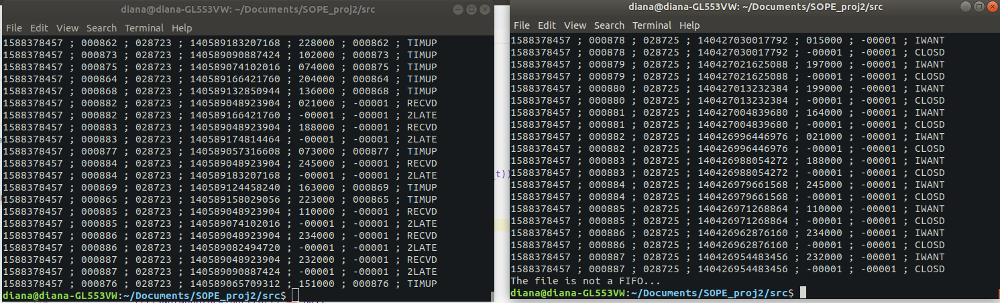
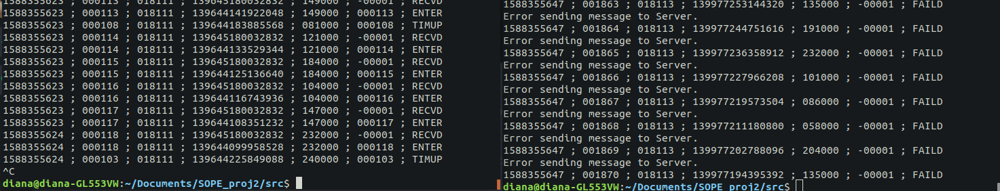

SOPE T02G05
----------

###### TRABALHO PRÁTICO Nº 2
# Acesso informático aos Quartos de Banho

## Descrição
Pretende-se obter uma aplicação do tipo cliente-servidor capaz de lidar com situações de conflito no acesso a zonas partilhadas. A zona partilhada é um Quarto de Banho com vários lugares unisexo, controlado por um processo Q ao qual se dirigem pedidos de acesso de utentes. Os pedidos de acesso são enviados por intermédio de um processo multithread U (cliente), e neles se indica o tempo que o interessado deseja estar num lugar das instalações sanitárias. Os pedidos ficarão numa fila de atendimento até terem vez; nessa altura, o utente respetivo acede a um lugar nas instalações durante o tempo pedido, sob o controlo do servidor Q; depois o recurso é libertado para outro utente. 

Com este projeto, demonstramos conhecer e saber utilizar a interface programática de UNIX em C para conseguir:

- criar programas multithread;

- promover a intercomunicação entre processos através de canais com nome (named pipes ou FIFOs);

- evitar conflitos entre entidades concorrentes, por via de mecanismos de sincronização.

## Relatório

### Como correr o programa

Em conjunto com os *source files*, existe um *Makefile* com os comandos usados para compilar todos os ficheiros. O nosso procedimento para correr e testar o programa era:
1. Abrir dois terminais em simultâneo, na pasta `src` deste diretório, contendo todos os ficheiros e o *Makefile*.
2. Executar o comando `make` num deles.
3. Correr os dois programas em simultâneo:
   1. Num dos terminais, correr `./Q1 -t <nsecs> <fifoname>` com a opção de redirecionar, ou não o output para os ficheiros `q1.log` e `q1.err`.
   2. No outro terminal, correr `./U1 -t <nsecs> <fifoname>` com a opção de redirecionar, ou não o output para os ficheiros `u1.log` e `u1.err`.
4. Esperar pelo seu término, de acordo com o tempo de execução estipulado para cada
5. Opcionalmente, se feito o redirecionamento do output para ficheiros de log, correr-se-ia o script `./testing.sh`, ou simplesmente o comando `make test`, para verificar eventuais testes sugeridos no enunciado.

### Estrutura das mensagens trocadas

Relativamente à estrutura das mensagens trocadas entre e o cliente e o servidor, optamos por utilizar a `struct message` onde o cliente guarda os dados do seu pedido e o servidor a respetiva resposta. 

O cliente irá guardar, nessa `struct`, o seu *PID* e *TID*, necessários para criar o canal privado onde recebe a resposta do servidor, a duração de tempo requisitado, e o seu número sequêncial. Por fim, envia ao servidor um pedido através do canal público recebido como parâmetro. 

Já no servidor, ao receber o pedido do cliente por esse canal público, deve alterar a `struct`, atualizando com o seu o PID e TID. No caso de o servidor já não estar em funcionamento, altera o pl e dur para -1, para indicar o encerramento do serviço. Assim envia a sua resposta ao cliente, pelo canal privado criado.

```c
typedef struct message {
    int i;
    pid_t pid;
    pthread_t tid;
    int dur;
    int pl;
    char fifoName[FIFONAME_SIZE];
} message;
```

### Tratamento do sinal SIGPIPE

Tendo em conta que, perante uma tentativa de escrita num FIFO que nenhum processo tenha aberto para leitura, o sinal `SIGPIPE` é enviado ao processo escritor, foi necessário em ambos os processos ignorar o sinal evitando que este conduza à terminação do processo e permitindo à função write retornar o erro `EPIPE`. Assim, quando o Servidor tiver terminado de modo forçado (`SIGINT` por exemplo) e é for feita uma tentativa de escrita por parte do Cliente, será escrito *FAILD* na saída padrão. Também no caso de o Cliente terminar abruptamente temos a possibilidade de detetar o erro aquando da tentativa de escrita de uma resposta por parte do Servidor.

```c
int ignoreSIGPIPE(){
    struct sigaction action;
    action.sa_handler = SIG_IGN;;
    sigemptyset(&action.sa_mask);
    action.sa_flags = 0;

    if (sigaction(SIGPIPE, &action, NULL) < 0){
        fprintf(stderr,"Unable to install SIG handler\n");
        return ERROR;
    }

    return OK;
}
```

### Intercomunicação entre processos através de canais com nome

>A utilização de FIFOs e de funções que permitem proceder à sua leitura e escrita permitiu proceder à troca de mensagens entre os processos do Cliente e do Servidor (Quarto de Banho).

#### Criação, Abertura e Leitura dos pedidos no Servidor 

No Servidor, depois de lidos os argumentos e após a criação do FIFO com o nome neles indicado ter sido executada com sucesso, procede-se à abertura do FIFO em modo de escrita, através da função `mkfifo(..)`. 

Seguidamente, na abertura do FIFO em modo de leitura, `O_RDONLY`, optou-se por ativar a flag `O_NONBLOCK`, pois, para podermos controlar o tempo de execução do servidor, independentemente de este ter ou não solicitações nesse período, é preciso evitar que a abertura do ficheiro com a função `open(...)` bloqueie pelo facto de não existir ainda nenhum processo com o FIFO aberto para escrita. Assim, o Servidor não fica durante tempo indeterminado à espera de Clientes - `open(...)` é bem sucedida e retorna imediatamente mesmo que o FIFO ainda não tenha sido aberto para escrita por nenhum processo, que será o caso.

```c
server_fd = open(fifoName,O_RDONLY|O_NONBLOCK)
```

Já no ciclo que recebe pedidos, vai ser feita a cada iteração uma tentativa de leitura do FIFO, utilizando a função `read(...)` para proceder à tentativa de leitura do número de bytes ocupados pela struct `message` e verificando o seu valor de retorno:
- No caso de, entretanto, os Clientes começarem a fazer os seus pedidos, isto é, o FIFO já ter sido aberto para escrita pelo processo *U1*, `read(...)` poderá:
    - retornar um valor inteiro maior do que zero, quando efetivamente foram lidos dados do FIFO - sendo devolvidos o número de bytes lidos, caso no qual se procede à criação de uma thread para processar o pedido; 
    - retornar `EAGAIN` pelo facto de o FIFO ter sido aberto em modo `O_NONBLOCK` e não existir nada no FIFO para ler naquele instante, caso no qual se avança para a próxima leitura, libertando o espaço anteriormente alocado para a mensagem do Cliente. 
- No caso de ainda não ter sido feito nenhum pedido, isto é, de o FIFO não se encontrar ainda aberto para escrita, a leitura vai retornar `EOF` pelo que o espaço previamente alocado para receber a mensagem do Cliente é libertado, passando-se para a próxima iteração do ciclo de receção de pedidos.

```c
int r;
    // Read message from client if it exists (without blocking)
    if((r = read(server_fd, msg, sizeof(message))) < 0){
        if(isNotNonBlockingError() == OK){
            free(msg);
            break;
        }
        else{
            free(msg);
            continue;
        }
    }
    else if(r == 0){ // EOF
        free(msg);
        continue;
    }    

    // Message received
    logOP(RECVD,msg->i,msg->dur,msg->pl);    
```

Um procedimento semelhante para leitura dos pedidos do FIFO público é adotado na função de início de thread responsável por gerar as threads que recusam os pedidos quando o servidor está a encerrar, `void * server_closing(void * arg)`.

#### Abertura e escrita de pedidos no processo Cliente

No Cliente, é feita a abertura para escrita, `O_WRONLY`, do FIFO passado nos argumentos. Seguidamente, no ciclo de geração de pedidos são criadas threads, ficando cada thread encarregue da geração de um pedido. É de notar que cada thread terá acesso ao descritor do FIFO criado na thread inicial, tal como é sugerido pela seguinte afirmação: ["threads share the same global memory (data and heap segments)"](http://man7.org/linux/man-pages/man7/pthreads.7.html).
Na função de início da thread `void * client_request(int * arg)`, é criado o FIFO com a identificação do cliente (*PID* e *TID*), usando `mkfifo(..)` mais uma vez.
Segue-se a escrita da mensagem através da função `write(...)`. No caso de o Servidor ter o FIFO aberto para escrita, a chamada desta função bloqueia a thread até se conseguir escrever a mensagem, retornando com sucesso quando termina a escrita.
Já no caso em que o Servidor não tem o FIFO aberto para escrita, que acontece quando se força a terminação do Servidor abruptamente com um *CTRL-C*, 'SIGINT', a chamada retornará um erro, que levará à escrita da mensagem *FAILD* na saída padrão.

```c
// Sends message to server
    if((write(fdserver, &msg, sizeof(message))) == -1){
        fprintf(stderr,"Error sending message to Server.\n");
        logOP(FAILD,msg.i,msg.dur,msg.pl);
        // ...
        return NULL;
    }
```
No caso de o envio do pedido ser bem sucedido, é aberto o FIFO criado pelo cliente em modo de leitura e é lida a resposta ao pedido realizado, sendo que a função `read(...)` bloqueia até que seja escrita a resposta ou até que o FIFO seja fechado para escrita.
Após interpretar a resposta do Servidor, o Cliente fecha(`close(...)`) e destrói (`unlink(...)`) o seu FIFO privado.

#### Receção dos pedidos nas threads do Servidor

Finalmente, tanto na função de início de thread que tem a responsabilidade de aceitar pedidos - `void * handle_request(void *arg)`; como na que é responsável por os recusar - `void * refuse_request(void *arg)`; procede-se à abertura do FIFO privado do Cliente com a função `open(...)` no modo de escrita. A escrita da resposta com a função `write(...)` poderá resultar numa leitura bem sucedida ou num erro no caso de uma leitura mal sucedida. Verificamos, no entanto, que quando se termina abruptamente o processo Cliente com um *CTRL-C* é raro conseguirmos terminar o processo exatamente no instante após a realização do pedido, *IWANT*, e antes da receção da resposta, ocorrendo o erro `EPIPE` em situações muito raras, o que leva a que seja difícil depararmo-nos com um *GAVUP*.

```c

 // Writing to Client FIFO
if(write(fd, msg, sizeof(message)) == -1){
        // Error detected. May be EPIPE 
        fprintf(stderr,"Error writing response to Client.\n");
        logOP(GAVUP,msg->i,msg->dur,msg->pl);
        //...
        return NULL;
    }

    // Writing occurred successfully - request accepted
    logOP(ENTER,msg->i,msg->dur,msg->pl);

```


### Espera do tempo especificado nos argumentos

Como mecanismo auxiliar de espera do tempo de funcionamento de cada programa, implementámos uma thread que corre paralelamente e cuja única função é esperar os `nsecs` especificados. O seu código é o seguinte:
```c

void * timeChecker(void * arg){

    // 1st element is the number of seconds to wait
    // 2nd element is to be set when terminated, for ending the while loop of the main thread
    int * terminated = (int *) arg; 

    int nsecs = terminated[0];
    sleep(nsecs);

    terminated[1] = 1;
    
    return NULL;
}

``` 
Passados os `nsecs`, a variável `terminated` é modificada e a função main recebe a indicação que terminou o seu tempo, saindo do loop de criação de threads.

### Mecanismos de sincronização usados

Nesta primeira parte do projeto, optámos por nos focar no funcionamento geral do especificado no enunciado. Os mecanismos de sincronização usados, para esta parte, resumem-se à necessidade de impedir um número elevado de threads a executar em simultâneo, sobretudo para não sobrecarregar o sistema, e, ao mesmo tempo, preparando já o suposto do campo `nthreads` da parte seguinte do projeto:

```c
// Used to wait for available threads without busy waiting
pthread_mutex_t threads_lock = PTHREAD_MUTEX_INITIALIZER;
pthread_cond_t threads_cond = PTHREAD_COND_INITIALIZER;

// ... Quando uma thread termina

void incrementThreadsAvailable(){
    pthread_mutex_lock(&threads_lock);
    threadsAvailable++;
    pthread_cond_signal(&threads_cond);
    pthread_mutex_unlock(&threads_lock);
}

// ... Na função main, antes de criar uma nova thread

pthread_mutex_lock(&threads_lock);

    while(threadsAvailable <= 0){
        pthread_cond_wait(&threads_cond, &threads_lock);
    }

    threadsAvailable--;
    
pthread_mutex_unlock(&threads_lock);

```

### Perído de fecho do servidor - recusar pedidos

Tal como indicado no enunciado, é necessário que o servidor notifique os clientes no tempo correspondente ao seu encerramento, isto é, quando ainda está a completar os pedidos anteriores. Para isso, optamos por utilizar uma thread que se responsabiliza por, após terminado o tempo de abertura do Servidor, enviar a resposta aos pedidos pendentes no buffer e aos que são feitos durante o tempo de encerramento. O `unlink(...)` é feito após esperar pelas threads já lançadas - `join(...)`, as quais duram o tempo requisitado pelo Cliente. Segue-se a alteração da variável `server_opened`, cujo endereço fora inicialmente enviado como argumento da função de início da thread que recusa os pedidos. Esta variável irá indicar então que o Cliente deixou de conseguir enviar novos pedidos, por deixar de conseguir localizar o FIFO no sistema de ficheiros com a função `lstat(...)`. Posto isto, perante um erro na leitura ou uma tentativa falhada de leitura, o ciclo que está a recusar pedidos termina, aguarda-se pelo envio das respostas que recusam os pedidos e termina-se o programa, fechando o descritor do FIFO.

```c

// ... in main function

 // Create thread to handle requests while server is closing
    pthread_t sclosing_thread;
    int server_opened = 1;
    pthread_create(&sclosing_thread, NULL, server_closing, &server_opened);

    // Wait for all threads to finish except the ones thrown when server was already closing
    for(int i = 0; i < threadNum; i++){
        pthread_join(threads[i],NULL);
    }

    if(unlink(fifoName) < 0){
        fprintf(stderr, "Error when destroying '%s'.\n",fifoName);
        exit(ERROR);
    }

    server_opened = 0; // To inform the thread that is closing requests that no more answers should be sent
    
    // Wait for the thread that is handling the requests sent when the server was closing
    pthread_join(sclosing_thread,NULL);

    // ... Close the server and stop receiving requests
    close(server_fd);

```

```c
void * server_closing(void * arg){

    int *server_opened = (int * )arg;

    while(1){

        if((r = read(server_fd,msg, sizeof(message))) < 0){
            // ...
        }
        else if(r == 0){
            // If server closed already and nothing is read then break
            if(!*server_opened)
                break;
            // ...
        }
        // ...
        pthread_create(&threads[threadNum], NULL, refuse_request, msg);
        // ...
    }

    // Wait for the threads that will inform clients that made requests when server was closing
    for(int i = 0; i < threadNum; i++){
        pthread_join(threads[i],NULL);
    }

    return NULL;
```
### Output esperado
Em todas as ocasiões, tanto no server como no client, as linhas de output seguem o formato:



Dependendo da ação a realizar, a última keyword é diferente, mas, na globalidade, o seu número de ocorrências está sempre relacionado, como esperado e previsto pelo enunciado (podem ser feitos os testes presentes no ficheiro [testing.sh](testing.sh)).

As situações de falha também são detetadas:



E as situações de desistência de um dado cliente, ainda que bastante raras, também podem ocorrer, como detetado na seguinte ocasião:


### Autores

Diana Freitas - [up201806230](mailto:up201806230@fe.up.pt)
Eduardo Brito - [up201806271](mailto:up201806271@fe.up.pt)
Maria Baía - [up201704951](mailto:up201704951@fe.up.pt)